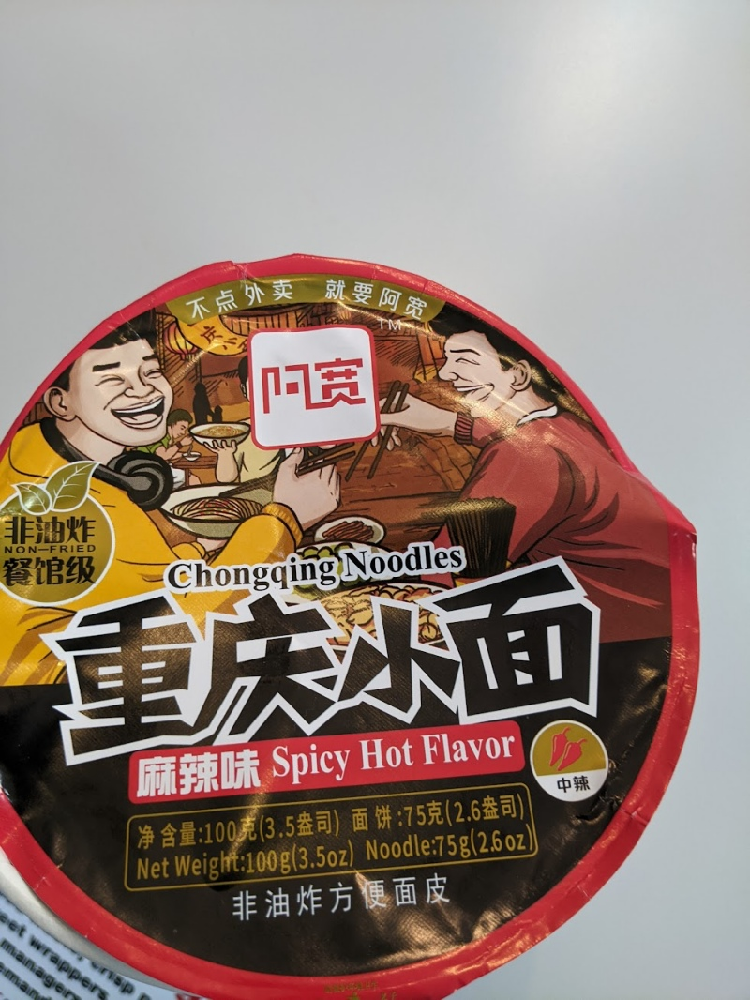

This is from the "Chong Qing" line but it wasn't terrible like the "battery acid" one.  This one says "DRY" but it's a soupy type!

It was definitely spicy hot, and required eating slowly.  

Add all the ingredients to a bowl, then add hot water.  Cover and wait for 3 minutes.  Stir, wait another 2 minutes, and then eat.  

