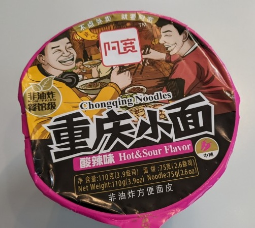

No instructions, but it's a soup type.  I found a YouTube video in Romanian of someone making it and I had to time them to figure it out.   

It turns out, the guy in the video was comparing the taste to battery acid. I should have listened.  

It was really bad.  The soup was very hot and sour, while eating, it felt like the tongue was burning and it overwhelmed all other tastes.  Even worse - the noodles didn't 'pick up' the flavoring at all, so it was just hot and tasteless.

Anyway the instructions: add all the ingredients to the noodles, add about 500 ml of hot water, and let it sit for 5 minutes. Stir, mix, and then throw it away because it's awful.  

