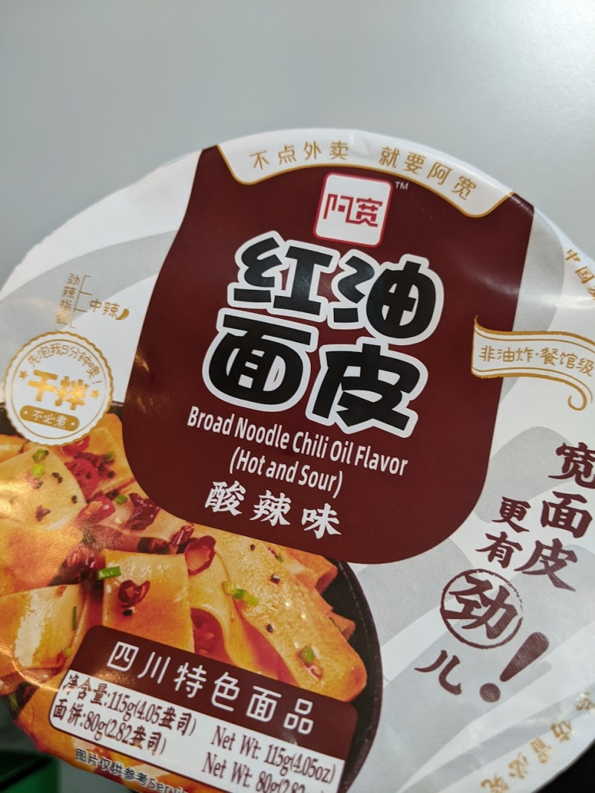

---

rating: 4
noodletype: broad
link_text: Starry Mart
link_url: https://starrymart.co.uk/baijia-a-kuan-sichuan-broad-noodle-chilli-oil-flavour-spicy-hot-bowl-110g.html
---

Another broad noodle winner.  It's hot and sour, but not overwhelmingly so (like the battery-acid type Chong Qing noodles).  It's almost as good as the Broad Noodle spicy hot version.  

Cover the noodles with hot water for 5 minutes, drain, then add all the ingredients and mix it up. 

