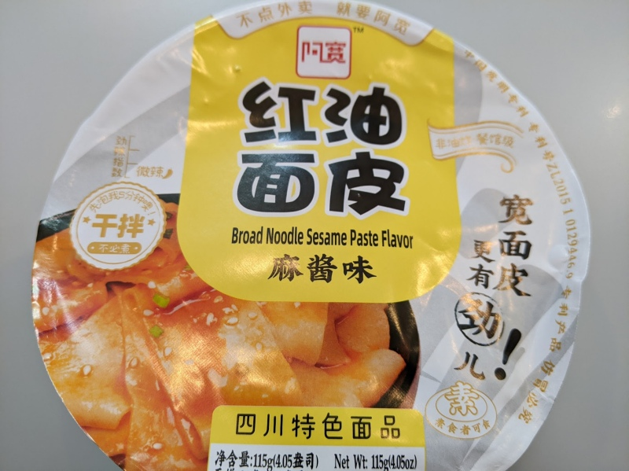

---

rating: 2
noodletype: broad
liquid: dry
link_text: Starry Mart
link_url: https://starrymart.co.uk/baijia-a-kuan-broad-noodle-sesame-paste-flavour-bowl-120g.html
date: 2022-10-29
---

Although I like broad noodles, this one wasn't very good.  The sesame paste tasted more of peanuts than sesame and overrode all other flavors. 

It was fine as a one-off but wouldn't have this regularly. 

Put noodles in a bowl, cover with hot water and wait 6 minutes. Drain the water, add the ingredients, and mix it up. 

