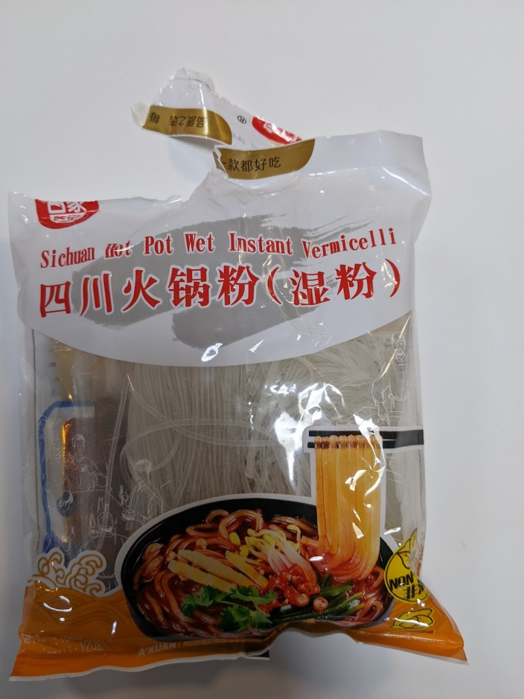

It's a vermicelli, which is uncommon in instant noodles.  The packaging packs a lot of ingredients in one place.  

The noodles are mildly and enjoyably spicy, with a soup.  There are plenty of pieces of bean sprouts, vegetables, and peas (though the peas were a bit 'dry').  

Add all the ingredients to a bowl, add 500 ml of water, and let it sit for 4 minutes.  Mix it up and serve. 

