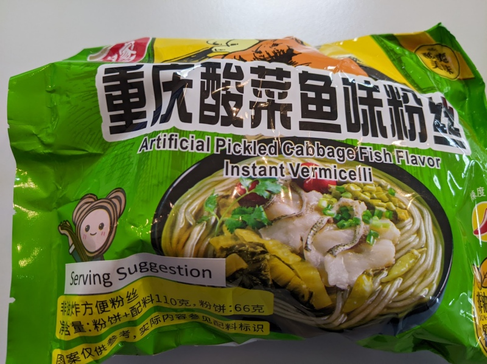

So, which part is artificial? The pickled cabbage, the fish flavor, or the vermicelli? 

It's a mildly spicy soupy noodle.  There's just enough chilli in the broth to keep it good.  There's also bits of pickle (or artificial pickle?) to help with the flavor in between.  Definitely worth trying. 

Add all the ingredients into a bowl, and cover with 500 ml of water for 4 minutes.  Mix it and serve.  

