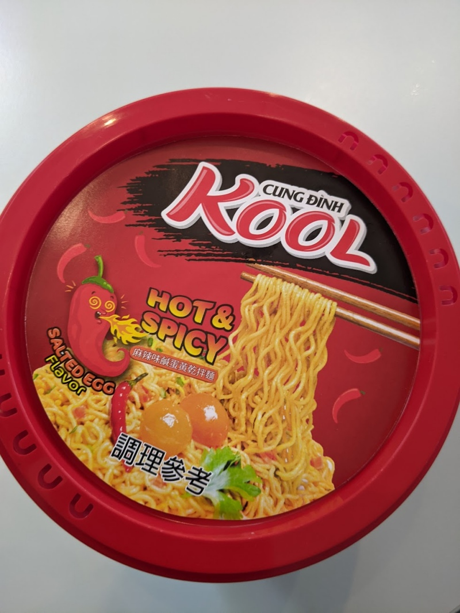

The name says spicy, but it isn't spicy, it's more savoury.  The taste is quite good, like salted eggs, and different from most other noodles.  However it isn't very filling and isn't sufficient on its own. 

Add the vegetable pouch, and cover in hot water for 4 minutes.  Drain the water through the holes in the lid, then add the remaining ingredients and mix it. 

