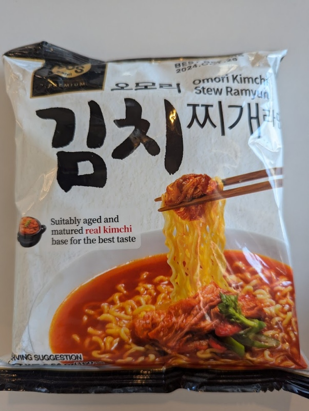

Despite the plain packaging, this had an excellent balance of tangy and spicy without being overwhelming. The amount of noodles included is really good too. The matured kimchi taste really stands out. 

Add all the ingredients to a bowl, add about 500ml water (enough to cover it at least) and wait 5 minutes before mixing and serving. 

