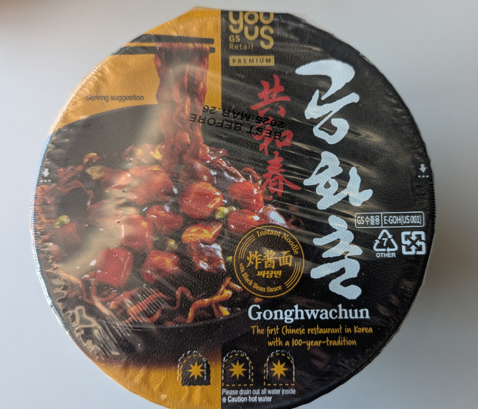

Black bean sauces are usually a safe bet, you know you're going to get a decent dose of flavour. Not so with this one. The sauce has a bit of sweetness but most of that is lost in the nothingness. The noodles themselves were quite good though, and the generous helping of the sauce coated the noodles well. Just that it was a bit of a struggle to get some taste. 

Add water to the fill line, cover and wait 4.5 minutes; drain, add the sauce and oil, then mix it well (takes a while) before serving. 

