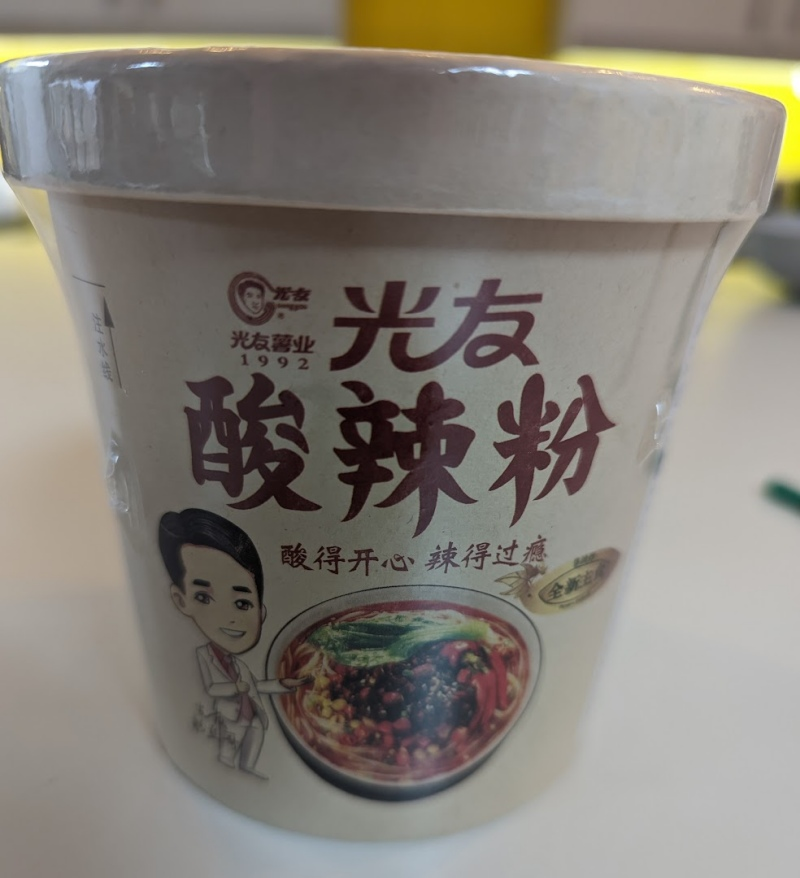

A vermicelli, soupy noodle with a lot of extra ingredients, including some sesame flakes and beans, in addition to the hot and sour paste.  The ingredients did blend well together and the noodles were able to hold on to some of the broth.  It's not super spicy, just mildly spicy and it has that trademark Guang You flavour I'm starting to recognise. 

Add all the ingredients into the bowl, add enough hot water to cover it (500ml roughly) and then wait for about 6 minutes before mixing and serving. 

