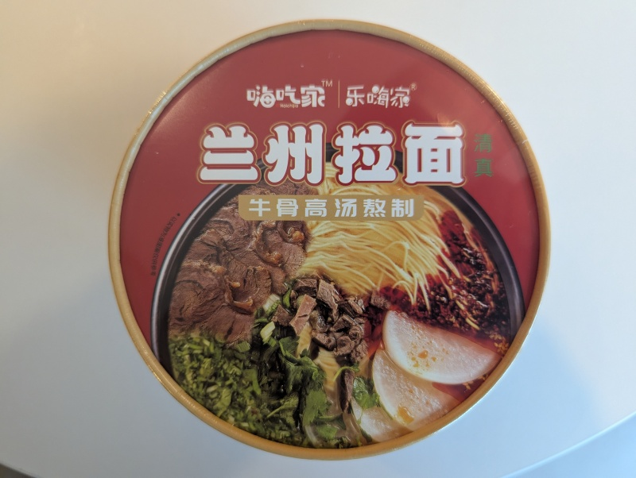

This was amazing, there were _two_ packs of noodles inside, with several packets of sauces, pastes and ingredients. It was a veritable feast inside a definitely not tiny packaging. It was a good hearty broth with plenty of liquid, ingredients and noodles to eat. I wasn't able to finish it but was left feeling satisfied. 

Mix all the ingredients together into the bowl, fill hot water up to the inner line, then cover and wait for 4-6 minutes. Mix it well and serve. 

