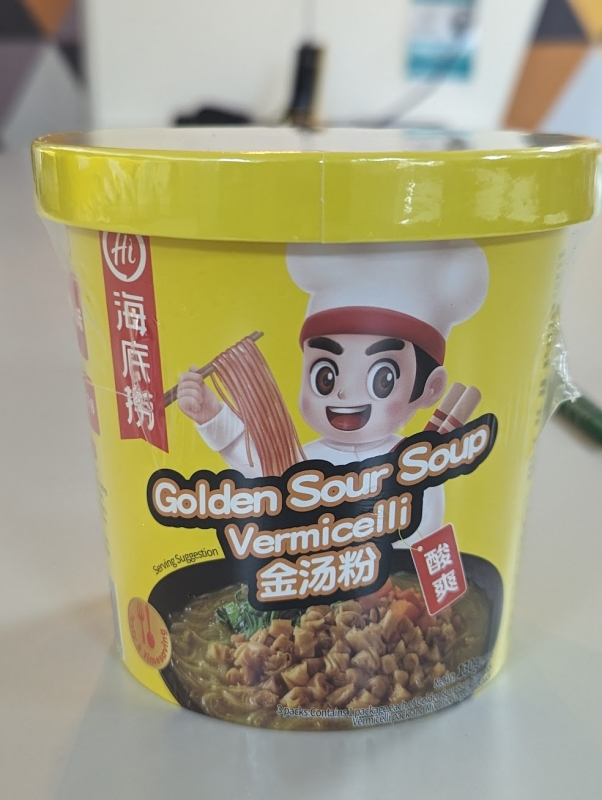

---

rating: 4
noodletype: thin glassy
liquid: broth
link_text:  
link_url:  
date: 2024-03-05
---

This one has quite a kick to it, it's just the right amount of sour, without going into 'battery acid' territory, and comes with a good dose of flavour and heat without being overwhelming. Overall it's really well balanced, and the flavour sticks to the vermicelli well.  

Add all the ingredients, add 500ml water (up to the red line inside), and wait 5 minutes. Stir it well before serving. 

