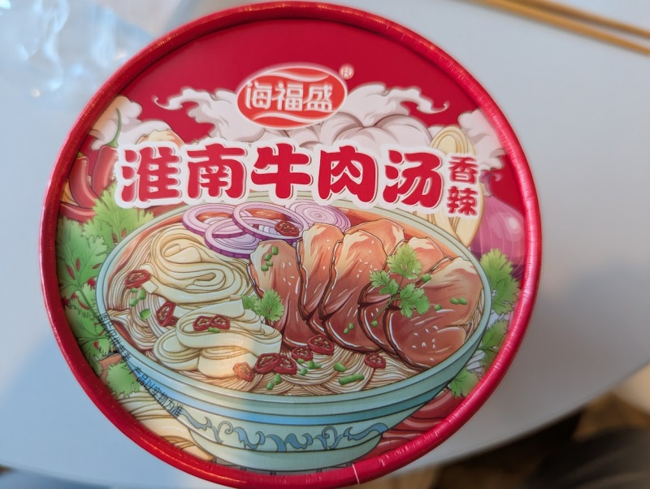

Manages to combine a beef flavour with a spicy, but not overwhelming, soup mixture. There are several packets of ingredients which work quite well. The vermicelli noodles don't get burning hot, so overall quite enjoyable. 

Just add all the ingredients, add 500ml of hot water, and wait about 5 minutes. Mix it well and then serve. 

