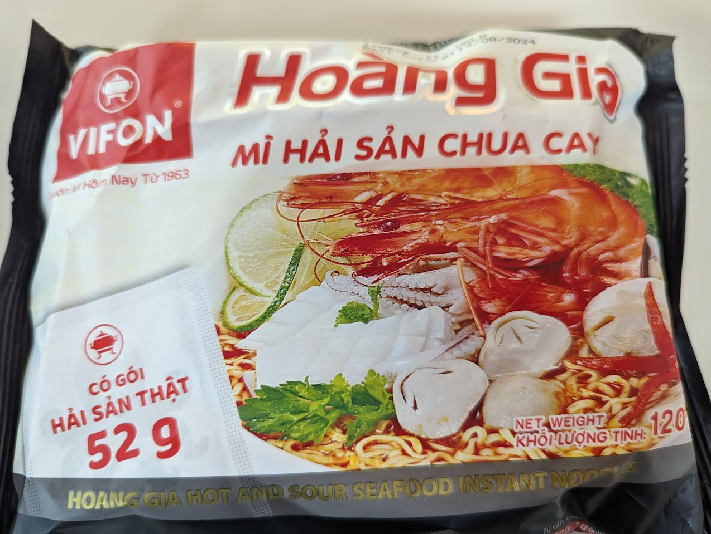

It's a hot and sour noodle, but with seafood flavour. I wasn't sure if the two combinations would work, but it somewhat works. The noodles and broth work well together, it's nice and chewy, though at times the smell felt a bit strong. 

Add all the ingredients into a bowl, including the noodles. Cover it with 400ml of water and let it sit for about 3-4 minutes. Then mix it up and serve. 

