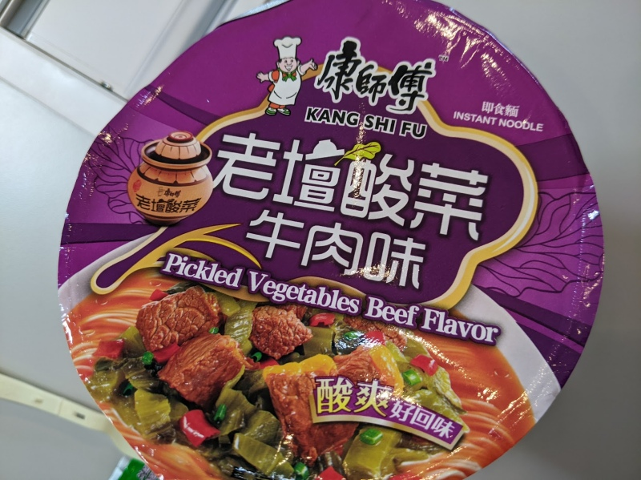

---

rating: 4
noodletype: thin

---

I found this in a high street shop.  It's a nice, soupy, but not very spicy, noodle with broth.  It has beef pieces and there's a good pickle-ish flavor that comes through.  

Add all the ingredients except the pickle.  Add hot water up to the line and wait 4 minutes.  Finally add the pickle and mix it. 

Sadly after I had this, I found [a health warning](https://www.cfs.gov.hk/english/press/20220317_9362.html) regarding "unhygienic processing of pickled vegetable products".  I did not find the results of the investigation however. 

