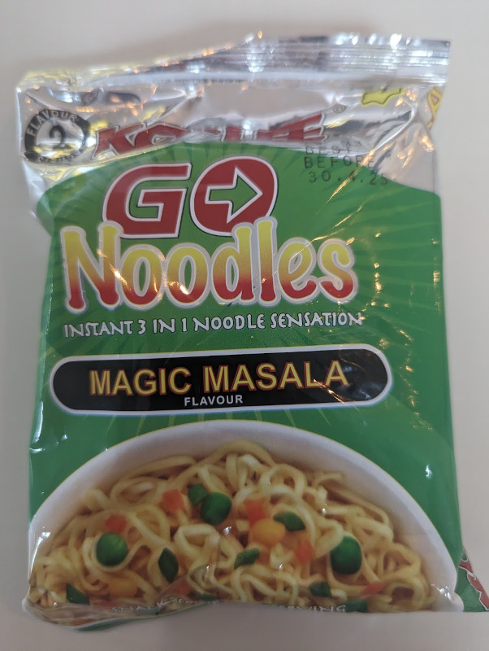

Chewy noodles with a mild heat to it. I found the flavour didn't retain for long, but the taste was good while it lasted. The portion appeared small, but was enough to fill me up.  

Add all the ingredients to a bowl, add up to 300 ml water (less water for more flavour), and wait 3 minutes before mixing and eating. Interestingly, the noodles can be had right in the packet by crushing the noodles and adding the seasoning. 

