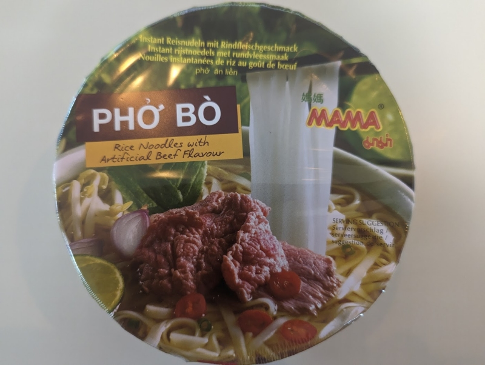

This was a mixed bowl, so to speak. The broth had a mild bit of heat to it, but the noodles weren't great and felt like they were working _against_ the broth. The ingredient portions were too stingy and not much taste made its way through. Almost passable. 

Uncover the lid, add the meagre ingredients, add hot water up to the line. Wait about 5 minutes, then mix it all together. 

