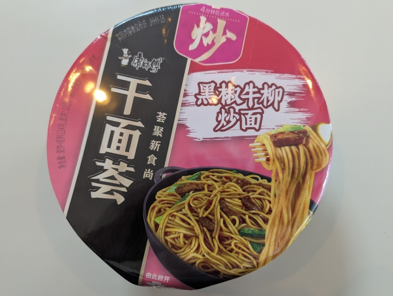

This one felt posh. The packaging was sturdy, the sachets were thick, it even came with its own fork. The noodles were quite good, the flavor had a hint of peppery spice to it and the sauce adhered to the noodles well. It was quite filling. 

Open up the lid about a third of the way, and add the vegetable packet. Add hot water up to the line, cover it up, you can use the other ingredient sachets to weight it down. Wait 4 minutes. Remove the draining 'lid' at the top, drain the water through the holes. After that remove the entire lid, add the rest of the ingredients and mix well. 

