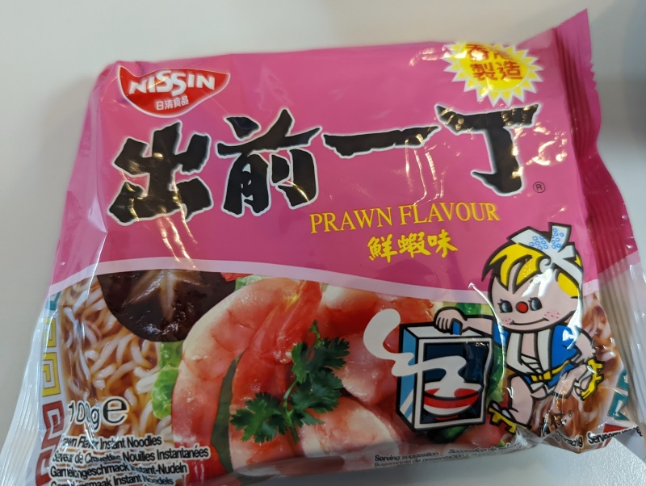

The flavor is very mild, even the prawn flavoring is mild, not spicy at all.  It's probably good for a one-off. 

Add about 600ml hot water in a bowl, break up the ramen so all of it gets soaked.  Wait 6 minutes, then add the ingredients and mix it up. 

