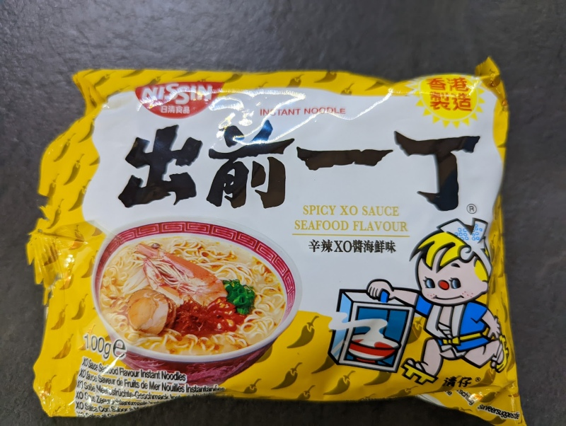

The flavor is very mild, I'm not sure what the 'spicy XO' flavor is supposed to be, but there were only hints of spiciness at times, it was mostly just seafood. 

Add about 600ml hot water in a bowl, break up the ramen so all of it gets soaked.  Wait 6 minutes, then add the ingredients and mix it up. 

