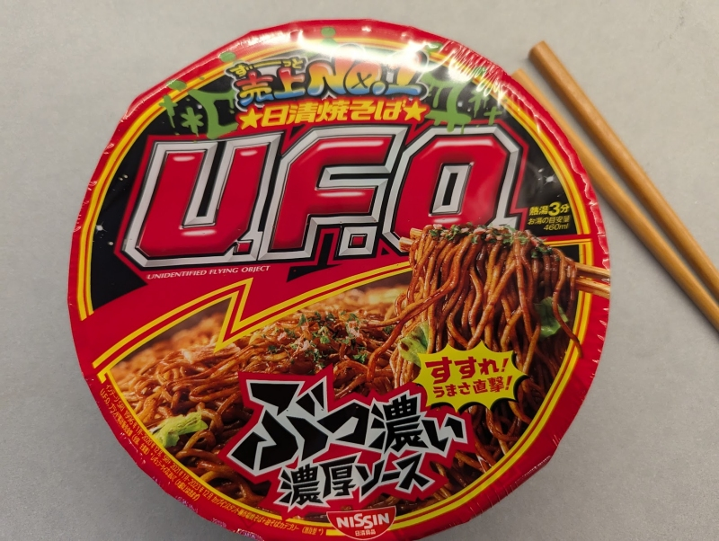

Unexpectedly good without having to be spicy. The sauce coats the noodles really well, and the noodles easy to pick up and eat. There are bits in there which is nice, and the portion size is quite good too. 

This is one of those drain types. open the lid halfway up, remove the sachets. Add hot water up to the line, cover it and put the packets on top. Wait about 3 minutes, then drain the water through the top holes. Now add the packets including the sauce, mix it well, and serve. 

