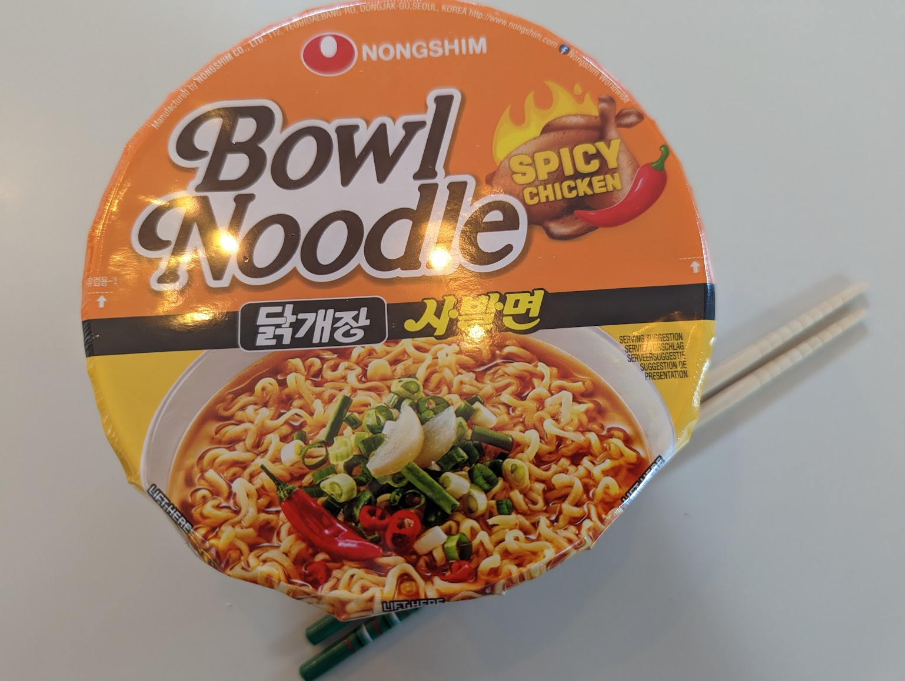

Again Nongshim's trademark soup, which is a fine balance between too brothy and too liquidy. The spice level is somewhat 'biting', though it didn't prevent me from finishing it.

Add all the ingredients, add hot water up to the line, and wait 3 minutes.  Mix and serve.  

