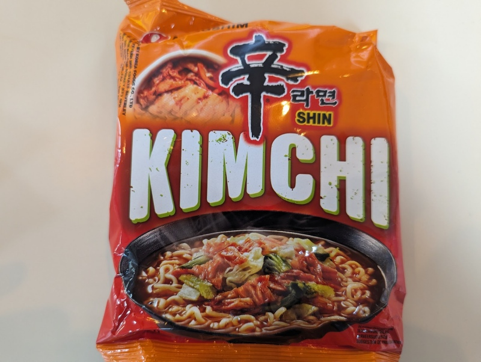

Probably one of the most popular Korean noodle brands, it strikes the perfect balance between spiciness, tanginess, and fulfillment. I actually have this one regularly at home, it goes really well boiled with [hot dogs](https://helenbrowningsorganic.co.uk/shop/product/hot-dogs/). 

Add all the ingredients to a bowl, add 500ml of hot water and wait for 4-5 minutes. Stir and serve. 

