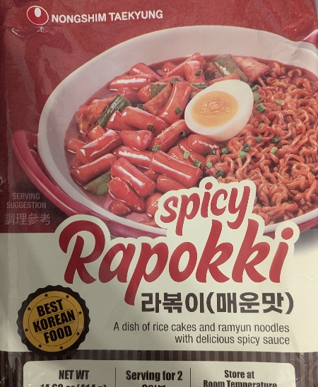

Although the soup was awesome as usual for Nongshim noodles, the overall noodles felt underwhelming and pointless. It was just noodles, and rice cakes, and some sauce. No vegetables, no meat, nothing. The taste didn't make up for the lack of substance and ingredients. 

In a bowl add the noodles, sauce and flakes. Cover with 420 ml of water, and let it sit for about 4 minutes. Mix and serve. 

