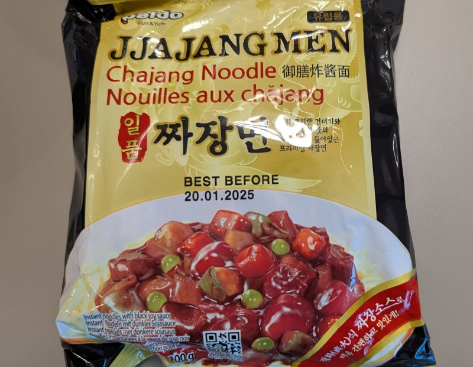

Bit of a mixed one, I like that this came with a packet of real sauce, and the black bean stuck to the noodles well. But overall it was decent, though nothing amazing. I'm thinking this might not be for the office, but for home, mixed with other ingredients. 

Add water to cover the noodles and wait 5 minutes. Drain the water, leaving a bit of liquid behind, then add the sauce and mix it up well before serving. 

