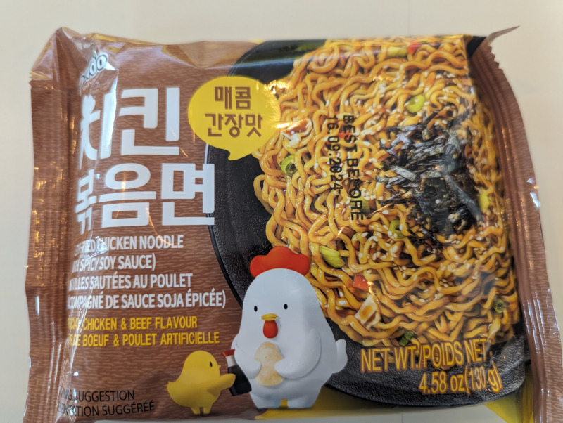

The amount of fussing about to prepare this wasn't worth the end result. The noodles themselves were good, but the sauce didn't stick well. It stuck well enough to give a hint of a taste, but most of the taste was in the sauce that _didn't_ stick. 

So. Cover the noodles and the flakes in water. Wait for 3-4 minutes. Then, drain most of water, losing some of the flakes and bits of noodle in the process. Leave some water behind, about 5 tsp worth. Add the sauce packet and mix it really well, do your best. Finally serve and try sipping the sauce that's collected at the bottom as you go, making the most of a weak situation. 

