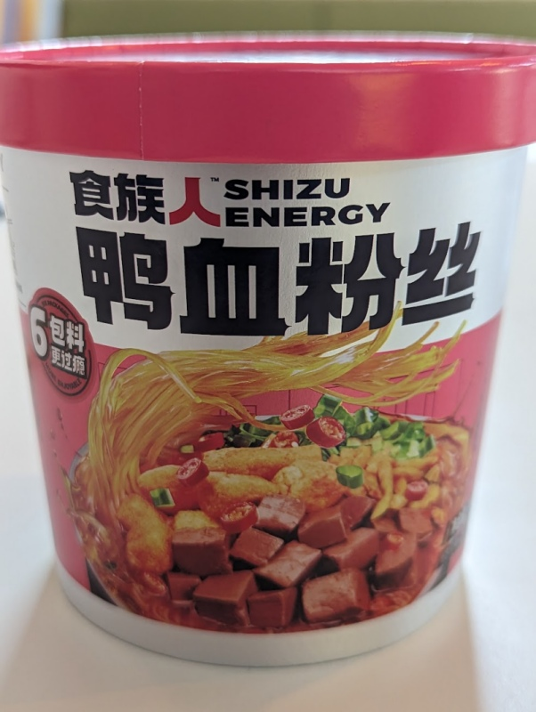

Yes, duck blood. The blood is actually in coagulated tofu-like pieces, and actually wasn't disgusting at all, it was just tasted of salt. The noodles came with several packets of ingredients including croutons and cabbages. Although the amount of noodles appeared to be small, the dish overall was actually very filling, strangely enough. The broth has some spice to it and the cabbages are tangy. 

Add all the ingredients into the bowl, and add hot water till it's covered, about 500ml. Leave it for 4-5 minutes, then mix and serve. 

