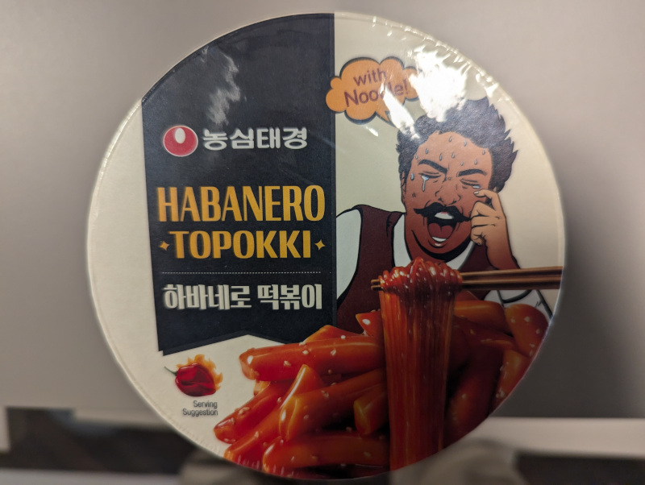

Another topokki, those cylindrical rice cakes, with some galssy noodles. The sauce is fiery, and does have a habanero kick to it. But the amount of food itself is tiny, and the noodles aren't easy to bite off either. Because they are glassy, they're slippery and they also burn the mouth due to heat retention. 

Add all the ingredients into the bowl, fill water up to the line (which is very low in the bowl). Then wait about 5 minutes (or microwave it for a few minutes). Mix it and serve. Stop buying these. 

