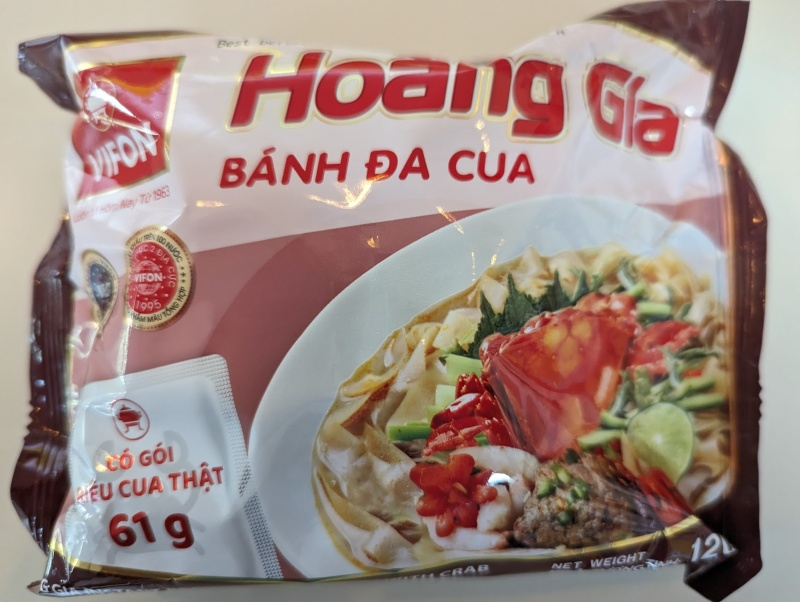

This is a Vietnamese noodle, and a rare case of seafood flavored noodles being actually good. There's a bag of crab paste included, and the noodles are made of brown rice. Overall it mixes quite well. 

Add the noodles and the ingredients except for the crab paste bag to 400ml of hot water. You really don't need a lot. Let it sit for about 3 minutes, then add the crab paste and mix it up. 

