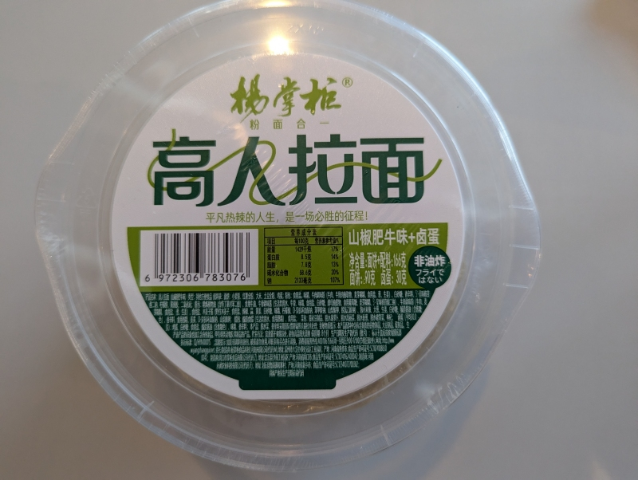

Despite its somewhat unpolished appearance, it's a really good noodle and package overall. The broth is tasteful with a dose of spicy (there are little chewy sweet-ish chillis), the beef flavour comes through nicely, and the noodles are plentiful in a good portion size. The package did come with a vacuum sealed braised egg (it looked like a smooth brown ovoid), but I think I would have simply done without it. 

There weren't any instructions I could find so I improvised. Add all the ingredients (except probably the egg) into the bowl. Add hot water up to the inside line, you can just about see it. Cover it up and wait 5 minutes, and then mix it, it's ready to serve. 

